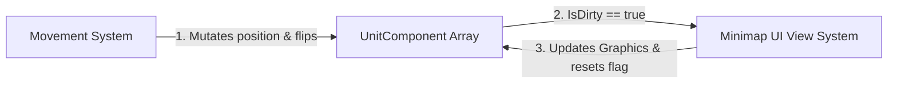
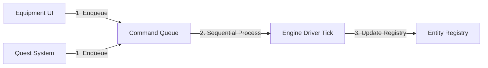
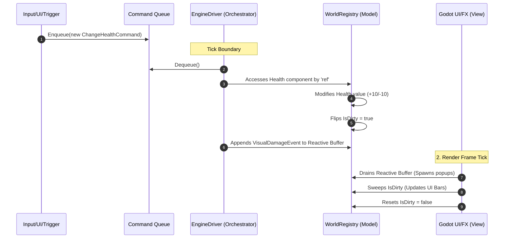

# Data-Oriented Event Handling in ECS (C++ Version)

To understand how events fit into a high-performance Entity Component System (ECS), we must abandon traditional Object-Oriented Programming (OOP) patterns.

In traditional games, events are driven by a **Push Model** using direct callback links like C++ `std::function` or observer patterns (e.g., `onDeath`, `onTakeDamage`). Attaching managed pointer objects or virtual method references directly inside ECS components breaks your memory layout, causes massive heap fragmentation, and creates tight engine coupling.

A mature, decoupled engine splits event handling into **three distinct, highly optimized pipelines**, each tailored to a specific class of data lifecycle problem:

1. **`IsDirty` Flags (State Persistence):** Polling flags embedded in long-lived component arrays.
2. **Reactive Event Buffers (Transient Spark):** Flat vectors for frame-bound, one-shot feedback.
3. **Central Delegate Registries (System Routing):** Lookup tables to route data configurations to compiled code logic.

## 1. The `IsDirty` Bitmask (For Persistent State Persistence)

* **The Concept:** A simple primitive boolean or bit flag embedded directly inside your long-lived, continuous component structures.
* **Best Used For:** Persistent variables that live indefinitely in memory but change unpredictably (e.g., player health bars, unit world positions, minimap markers).
* **The Workflow:** The Controller mutates the data and flips the flag to `true`. At the end of the frame, the View sweeps the memory bank, processes *only* the data elements marked true, updates its on-screen nodes, and flushes the flag back to `false`.



#### C++ Implementation

```cpp
namespace Game::Model
{
    // High-performance POD (Plain Old Data) struct sitting contiguously in a memory block
    struct HealthComponent
    {
        int EntityId;
        int CurrentHp;
        bool IsDirty; // The gatekeeper tracking flag
    };

    class HealthRegistry
    {
    private:
        HealthComponent _pool[1024];
    public:
        HealthComponent& GetModifiable(int id) { return _pool[id]; }
        HealthComponent* GetPool() { return _pool; }
        size_t GetPoolSize() { return 1024; }
    };
}

```

## 2. The Reactive Event Buffer (For Transient, One-Shot FX)

* **The Concept:** Instead of an active callback trigger, we push a temporary `struct` into a global array buffer. This is known as a **Frame Backlog**.
* **Best Used For:** Instantaneous, one-shot transactions that happen on a specific frame and leave behind no permanent data state (e.g., triggering a screen shake, spawning blood particles, or playing a slashing audio cue).
* **The Workflow:** Logic systems drop raw event records into a flat `std::vector` throughout the frame. The View iterates through this queue sequentially to trigger graphic effects, and then the controller wipes the list clear via `.clear()`, dropping memory overhead to zero with no dynamic allocation overhead.

#### C++ Implementation

```cpp
#include <vector>

namespace Game::Events
{
    // Pure POD struct event notification
    struct VisualDamageEvent
    {
        int TargetEntityId;
        int DamageAmount;
    };

    class CombatSystem
    {
    public:
        // Pre-allocated frame event buffer
        std::vector<VisualDamageEvent> FrameEvents;

        void ApplyStrike(Model::HealthComponent& target, int damage)
        {
            target.CurrentHp -= damage;
            target.IsDirty = true; // State persistence tracking

            // Transient Event Logging: No heap allocation if vector has reserve()
            FrameEvents.push_back({ target.EntityId, damage });
        }
    };
};

```

## 3. The Central Delegate Table (For Decoupled System Routing)

* **The Concept:** A hash map lookup that links a data-driven text keyword directly to a high-performance compiled function pointer.
* **Best Used For:** Mapping external game asset attributes—like AI routine choices or skill types from `definitions.json`—to code execution pipelines.
* **The Workflow:** Systems query this database at runtime using data-driven asset strings, instantly resolving actions to compiled functions without heavy runtime conditional testing chains.

#### C++ Implementation

```cpp
#include <unordered_map>
#include <functional>
#include <string>

namespace Game::Ai
{
    class AiRoutineSystem
    {
    private:
        // Maps an external configuration string to an executable function pointer
        std::unordered_map<std::string, std::function<void(int)>> _routingTable;
        Model::HealthRegistry& _registry;

    public:
        AiRoutineSystem(Model::HealthRegistry& registry) : _registry(registry)
        {
            _routingTable["GoToSleep"] = [this](int id) { ExecuteSleepRoutine(id); };
            _routingTable["FleeFromDanger"] = [this](int id) { ExecuteFleeRoutine(id); };
        }

        void ExecuteAction(const std::string& keyword, int entityId)
        {
            if (_routingTable.find(keyword) != _routingTable.end())
            {
                _routingTable[keyword](entityId); // Executes instantly
            }
        }

        void ExecuteSleepRoutine(int entityId)
        {
            auto& health = _registry.GetModifiable(entityId);
            health.CurrentHp += 10;
            health.IsDirty = true;
        }

        void ExecuteFleeRoutine(int entityId) { /* Movement logic... */ }
    };
}

```

## 4. The Command-Driven Queue (For Transactional State Mutations)

* **The Concept:** A sequential buffer of transactional "intent" objects that decouple the *request* for a state change from its *execution*.
* **Best Used For:** High-stakes logical state changes that require strict ordering and safety (e.g., equipping an item, leveling up a stat, or spawning a new NPC).
* **The Workflow:** Systems drop a `GameCommand` struct into the `EngineDriver`'s queue. At the beginning of the next `Tick`, the engine drains the queue sequentially, ensuring all state mutations are processed in a controlled, predictable order.



#### C++ Implementation

```cpp
#include <queue>

namespace Game::Commands
{
    enum class CommandType { EquipItem, UpdateStats, SpawnEntity };

    // Sequential transaction request
    struct GameCommand
    {
        CommandType Type;
        int EntityId;
        int TargetId;
    };

    class CommandQueue
    {
    private:
        std::queue<GameCommand> _commands;
    public:
        bool HasCommands() const { return !_commands.empty(); }
        void Enqueue(GameCommand cmd) { _commands.push(cmd); }
        GameCommand Dequeue() { auto cmd = _commands.front(); _commands.pop(); return cmd; }
    };
}

```

### Production Summary Strategy

| Event Architecture Axis | Primary Responsibility | Data Storage Context | Data Lifespan |
| --- | --- | --- | --- |
| **1. `IsDirty` Flags** | Syncing permanent UI text displays, map coordinates, and persistent graphics nodes. | Packed inside the component data struct array layout. | **Persistent** (Lives until entity is removed). |
| **2. Reactive Buffers** | Triggering temporal audio assets, particle emissions, screen shake, and floating text pops. | Pre-allocated global context frame lists. | **Transient** (Wiped clean at the end of each frame). |
| **3. Delegate Tables** | Directing action strings from `definitions.json` directly to high-speed logic methods. | Immutably stored inside the System Bootstrapper context registry. | **Static** (Set once at engine initialization). |
| **4. Command Queues** | Mediating state changes (Equip, Stats, Spawn). | Sequential Queue of structs/commands in `EngineDriver`. | **Frame-Bound** (Processed and cleared every tick). |


---


## When to use each one

Here is an extended, practical production guide detailing exactly when to deploy each of the four ECS event pipelines during game development.

### 1. When to Use: `IsDirty` Bitmask Flags

**Rule of Thumb:** Use this when a value represents a long-term **state** of an entity, and a visual system needs to continuously mirror that state on screen without wasting CPU power recalculating things that haven't changed.

**User Interface (UI) Data Synchronization:**
* Updating progress bars, numeric readouts, and sliders (e.g., Health bars, Mana reserves, Shield capacity, Level-up XP bars, Ammo counters).
* Refreshing inventory grids only when an item is added, moved, or consumed.


**Transform & Positioning Maps:**
* Synchronizing 2D/3D visual graphics nodes with your background physics simulation positions.
* Updating unit locations on a strategic Minimap or World Map.
* Recalculating field-of-view (Fog of War) outlines only when an entity physically crosses a tile boundary.


**Static & Dynamic Attribute Changes:**
* Recalculating total combat stats (e.g., Attack Power, Crit Chance) only when armor is modified or a permanent buff is applied.
* Changing the visible state of an environmental object (e.g., opening/closing a door, turning a light grid source on/off).


**Networking & Replication:**
* Flagging data values that need to be packaged and synced over the network to client machines during the next server replication cycle.


### 2. When to Use: Reactive Event Buffers

**Rule of Thumb:** Use this when an occurrence is a one-shot, instantaneous **transaction** that happens on a specific frame, leaves behind no permanent state data, and requires immediate visual or auditory feedback.

**Combat Feedback & "Juice":**
* Spawning floating text pops (e.g., critical hit numbers, "+10 XP", "Miss!").
* Triggering screen shake, gamepad vibration, or camera flashes when an explosion or heavy impact occurs.
* Spawning transient particle effects (e.g., blood splatters, muzzle flashes, dust clouds on a landing jump).


**Audio Orchestration:**
* Firing specific sound clips at the correct screen coordinates (e.g., footsteps, sword clangs, weapon reloads, ambient breaking glass).


**Lifecycle Disposals & State Transitions:**
* Handling Entity Death (e.g., alerting a loot drop system to spawn items at coordinates, playing a death animation, or updating a quest kill tracker).
* Tracking specific milestones achieved during a single frame (e.g., "Quest Completed", "Level Up!" flash animations).


**Transaction Logs & Narrative Analytics:**
* Passing a log of what happened to an on-screen scrolling text log window (e.g., *"Goblin deals 12 damage to Hero"*).


### 3. When to Use: The Central Delegate Routing Table

**Rule of Thumb:** Use this at initialization time to bind data configuration files directly to structural logic systems, avoiding massive, nested `switch-case` branches and hardcoded logic pathways.

**Data-Driven AI Routine Behavior Parsing:**
* Mapping action string keywords from an NPC schedule file (e.g., `"PatrolSector"`, `"GoToSleep"`, `"FleeToSafety"`) directly to their compiled backend execution methods.


**Item & Skill Modification Engines:**
* Routing unique functional triggers for usable inventory items (e.g., an item file specifies `"UseEffect": "TriggerHeal"` or `"UseEffect": "ApplyPoison"`).
* Executing modular magic spell effects from a spell dictionary data asset.


**Environmental Interaction Mapping:**
* Handling player interaction scripts with distinct puzzle objects (e.g., an object file links a physical lever to `"ActivateBridge"`, `"OpenVault"`, or `"TriggerTrap"` routines).


**Console Commands & Cheat Intakes:**
* Binding terminal text inputs parsed from an in-game developer debug console (e.g., `/godmode`, `/spawn_enemy`, `/noclip`) directly to internal management routines.

### 4. When to Use: Command-Driven Queue

**Rule of Thumb:** Use this when you need to perform an operation that modifies the engine's core state (e.g., entity registration, stat recalculation, inventory changes) but requires synchronization to prevent race conditions or invalid memory access during the `Tick`.

**Logical State Mutations:**

* **Equipping/Unequipping:** Moving an item from an inventory array to an equipment slot, ensuring the stat recalculation happens in a controlled sequence.
* **Stat Recalculation:** Triggering a full update of an entity's `EntityStats` based on new class/race formulas after a buff or level-up.
* **Lifecycle Management:** Spawning, despawning, or re-initializing entities, where doing so "mid-tick" would risk corrupting the SoA (Structure of Arrays) buffers.

**Cross-System Synchronization:**

* **Deferred Logic Execution:** When a system (like a UI click handler) needs to trigger a logic change in the `EntityRegistry`, but the `EntityRegistry` is currently locked or being iterated over by another system.
* **Batch Processing:** Collecting multiple state-change requests over the course of a frame and resolving them at the start of the next `Tick` to ensure a consistent game state.

## Summary Cheat Sheet: Architectural Filter Matrix

When implementing a new feature, ask your team these two diagnostic questions to choose the correct layout pipeline instantly:

```text
               Is it a permanent value, a transient spark, or a state transaction?
                                        |
        +-------------------------------+-------------------------------+
        |                               |                               |
 [ Permanent Value ]           [ Transient Spark ]            [ State Transaction ]
        |                               |                               |
Does it exist in memory?    Is it driven by data strings?   Does it change game state?
        |                               |                               |
  +-----+-----+                   +-----+-----+                   +-----+-----+
  |           |                   |           |                   |           |
(Yes)       (No)                (Yes)       (No)                (Yes)       (No)
  |           |                   |           |                   |           |
  v           v                   v           v                   v           v
IsDirty    (Not an             Delegate    Reactive           Command     (N/A)
Flag      ECS Event)           Registry     Buffer             Queue

```


## Separation of Concerns

* **IsDirty Flags** are for *Observability* (View systems watching the Model).
* **Reactive Buffers** are for *Feedback* (Transient visual/audio output).
* **Delegate Tables** are for *Configuration* (Mapping data keywords to logic).
* **Command Queues** are for *Orchestration* (Ensuring mutations happen in the right order).


## Example: Dynamic Data Flow

In this example, an entity receives a 10 Hit Points.

When an entity receives **10 HP** (damage or healing), your engine no longer allows systems to mutate data directly. Instead, it processes the change as a transactional workflow that coordinates the Command Queue, the IsDirty Flag pipeline, and the Reactive Event Buffer pipeline in a single, deterministic sequence.

The process moves sequentially down a clean pipeline across your layers:

### The Dynamic Data Flow



### Step 1: Enqueueing the Intent (Command Queue)

```cpp
void RequestHealthChange(int entityId, int amount)
{
    _engineDriver.AddCommand({ CommandType::AdjustHealth, entityId, amount });
}

```

### Step 2: Processing the Transaction (EngineDriver)

```cpp
while (_queue.HasCommands())
{
    auto cmd = _queue.Dequeue();
    if (cmd.Type == CommandType::AdjustHealth)
    {
        auto& health = _registry.GetModifiable(cmd.EntityId);
        health.CurrentHp += cmd.Value;
        health.IsDirty = true;
        _combatSystem.FrameEvents.push_back({ cmd.EntityId, cmd.Value });
    }
}

```

### Step 3: The View Layer (Reactive & Polling)

**Phase A: Reactive Buffer (Visuals)**

```cpp
for (const auto& evt : _combatSystem.FrameEvents)
{
    SpawnFloatingText(evt.TargetEntityId, evt.DamageAmount); 
}
_combatSystem.FrameEvents.clear(); 

```

**Phase B: `IsDirty` Sweep (UI)**

```cpp
auto* pool = _registry.GetPool();
for (size_t i = 0; i < _registry.GetPoolSize(); ++i)
{
    if (!pool[i].IsDirty) continue;

    UpdateLabel(pool[i].EntityId, pool[i].CurrentHp);
    pool[i].IsDirty = false;
}

```

---

## 5. Dense Life Cycles: Object Pools & Blind Sweeps

For high-velocity simulation (e.g., 5,000 projectiles), we use **Object Pool + Sequential Blind Sweep**.

### Production C++ Blueprint: The Bullet Pool

#### 1. The Pure Model Layout

```cpp
struct BulletComponent {
    float X, Y;
    float VX, VY;
    bool IsActive;
};

class BulletRegistry {
public:
    BulletComponent Pool[5000];
    
    void SpawnBullet(float x, float y, float vx, float vy) {
        for (auto& bullet : Pool) {
            if (!bullet.IsActive) {
                bullet = { x, y, vx, vy, true };
                return;
            }
        }
    }
};

```

#### 2. The Controller Logic

```cpp
void ProcessBullets(BulletComponent* bullets, size_t count, float dt) {
    for (size_t i = 0; i < count; ++i) {
        if (!bullets[i].IsActive) continue;
        bullets[i].X += bullets[i].VX * dt;
        bullets[i].Y += bullets[i].VY * dt;
        if (bullets[i].X < -100 || bullets[i].X > 2000) bullets[i].IsActive = false;
    }
}

```

#### 3. The View System

```cpp
void DrawActiveBullets(const BulletComponent* bullets, size_t count) {
    for (size_t i = 0; i < count; ++i) {
        if (!bullets[i].IsActive) continue;
        LowLevelGraphics::Draw(bullets[i].X, bullets[i].Y);
    }
}

```

## When to Use Object Pools & Blind Sweeps

When you have a massive swarm of combatants or projectiles crowding the viewport, the engine faces the exact same challenge as a bullet hell game: **the data is dense, short-to-medium lived, and nearly every entity is actively doing something every single frame**.

### 1. In Gauntlet Games (Horde/Swarm Management)

In a gauntlet-style horde game, you might have 3,000 basic zombies running toward the player.

* **The Problem with `IsDirty`:** If you try to use `IsDirty` flags to track zombie positions, you waste time. Because 100% of those zombies are actively pathfinding and moving toward the player every single frame, 100% of your flags will be `true`.
* **The Object Pool + Blind Sweep Solution:** When a zombie dies, it isn't deleted from memory; its slot in the pool is simply marked `IsActive = false`. When a new wave spawns, slots are flipped back to `true`. Your `MovementSystem` and your `RenderSystem` blindly sweep through the contiguous array, updating and drawing only the active indices. The CPU prefetcher streams the zombie data into the hardware cache efficiently, allowing the engine to handle thousands of enemies without dropping frames.

### 2. In Big Army Battles (The "Flocking" and Simulation Boost)

When simulating two massive armies clashing, your systems need to compute physics, steering behaviors, and combat ranges simultaneously for thousands of soldiers.

* **Cache-Aligned Combat Math:** By keeping soldier structs packed tightly in an Object Pool, a `CombatSystem` can run a Blind Sweep to check distances between soldiers. Because the memory is contiguous, the CPU handles these massive multi-entity proximity loops significantly faster than if it had to jump between scattered heap-allocated objects.
* **The Rendering Speedup (Batching):** Instead of giving each soldier their own individual Godot Node or Unity GameObject (which introduces heavy engine rendering overhead), a Blind Sweep lets you extract raw position coordinates from the active pool slots and pass them directly to the GPU in a single, massive batch draw call (such as MultiMeshInstance in Godot or Instanced Rendering in Raylib/MonoGame).

## Other uses of Object Pools & Blind Sweeps

Beyond a bullet hell game, this pattern is mandatory for several major subsystems in game development:

* **Particle & Visual FX Systems:** Spawning sparks, smoke clouds, blood splatters, water splashes, or fire embers where hundreds of tiny visual layers must update coordinates and fade out over fractions of a second.
* **Floating Combat Text (FCT) Managers:** Spawning popping damage numbers, critical hit flashes, or healing indicators in an Action RPG or MMORPG where dozens of entities are taking damage simultaneously.
* **Audio Sample Players:** Managing voice/sound channels. When 100 explosions go off, a sound pool activates 32 available hardware voice instances, plays the audio clips, and instantly releases those channels back to the pool once finished.
* **Ambient Environmental Crowds:** Simulating massive backdrops of non-interactive elements, such as schools of fish, flocks of birds, or a street filled with thousands of simple wandering city pedestrians.
* **Debris & Gore Management:** Tracking dropped shell casings from a machine gun, breaking glass fragments, or scattering armor plates that fly off a mechanical enemy during combat.


### Summary Architectural Matrix

To wrap your mind around your entire event and instance toolbelt, use these two quick layout reference guides:

| Feature Requirement | Data Density | Longevity | Best Architectural Pattern |
| --- | --- | --- | --- |
| **RPG Character Health Screen** | **Sparse** (Changes occasionally) | Long-Lived | **`IsDirty` Flags + View Polling** |
| **Instant Level-Up Flash FX** | **Sparse** (Happens once) | Short-Lived | **Reactive Event Buffers** |
| **AI Routine Keyword Binding** | **Static** (Configured at boot) | Permanent | **Central Delegate Routing Tables** |
| **5,000 Projectiles / Particles** | **Dense** (100% change every frame) | Short-Lived | **Object Pools + Sequential Blind Sweeps** |
| **Cross-System State Changes** | **Low** (Discreet Events) | Transient | **Command-Driven Event Queue** |

<br>

| Game Mechanic Feature | Data Style | Lifespan | The Correct Pattern Combination |
| --- | --- | --- | --- |
| **UI Displays & Character Stats** (Health screens, Inventory grids, Level tracking) | **Sparse** (Changes occasionally) | Long-Lived | **`IsDirty` Flags + View Polling** |
| **Juice & One-Shot Audio** (Explosion flashes, Sound effects, Damage numbers) | **Sparse** (Instant occurrences) | Transient | **Reactive Event Buffers** |
| **Data-Driven Configuration** (AI routine strings, Skill blueprints from JSON) | **Static** (Set at boot time) | Permanent | **Central Delegate Routing Tables** |
| **Swarms / Projectiles** (Bullets, Army Troops, Horde Enemies, Particles) | **Dense** (100% change every frame) | Short/Medium | **Object Pools + Blind Sweeps** |
| **State Mutations** (Equipping items, Stat leveling, NPC spawning) | **Discrete** (Logic-driven events) | Transient | **Command-Driven Queue** |

